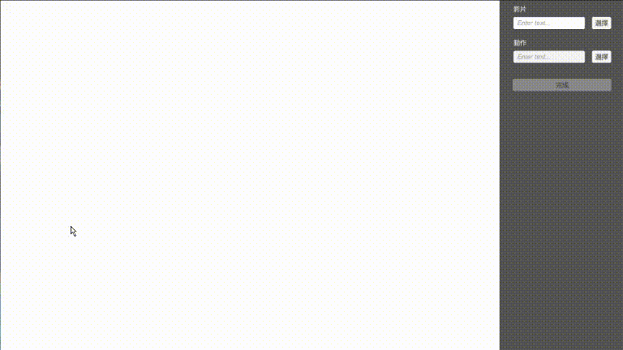
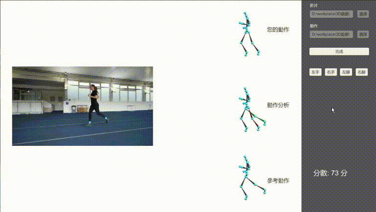

# Dancing Game

> 台灣科技大學 - 3D 電腦遊戲 - Project 5

## 介紹

雖然名為 Dancing Game，但實則是將影片辨識下來的骨架與已知的骨架做比對，並顯示兩者之間局部區域的動作差異，並給予分數。

[^1]

[^1]: 影片來源：[How To Run Properly | Running Technique Explained](https://www.youtube.com/watch?v=_kGESn8ArrU&t=82s&ab_channel=GlobalTriathlonNetwork)

## 使用方式

* 選擇比較的影片與骨架 BVH 檔，並按下完成

  

> 這邊的 BVH 使用的是 CMU Graphics Lab 所提供的資料集[^2]，或是讀入骨架結構一樣（共 31 個關節且命名一樣、垂直關係相同）的 BVH

[^2]: [CMU Graphics Lab Motion Capture Database](http://mocap.cs.cmu.edu/)

* 等待載入完成後，會開始播放並取得對應的骨架

  

* 產生出結果
  

* 切換關注的部位

  

## 技術說明

### 載入 BVH 檔

與 [Motion-Path-Editing](https://github.com/CCCpeggy/Motion-Path-Editing) 幾乎相同，不過這邊改為針對 CMU 資料集的格式。因為此資料集的關節命名固定，所以依據關節名稱來判斷關節類型。

### 骨架辨識

使用 [ThreeDPoseUnityBarracuda](https://github.com/digital-standard/ThreeDPoseUnityBarracuda)，它使用 VNect[^3] 的方法來辨識骨架，且它有提供現成的 Vnect 模型檔。它再透過 VNect 取得 Heat Map[^4]，並從 Heap Map 中找到最有可能的點作為關節，再透過 Kalman Filter 來去除雜訊。

[^3]: VNect: Real-time 3D Human Pose Estimation with a Single RGB Camera
[^4]: Heap map 上數值越高，代表那個位置越有可能是那個關節

### 骨架轉換

要將影片錄製下來的骨架，轉換成與 CMU 骨架相同的資料儲存方式，其中兩者的關節數量不同，且影片的骨架是以每 frame 的位置做儲存，而 CMU 的骨架則是用旋轉角度做儲存。

#### 將影片的骨架轉成跟 CMU 資料集的格式相同

根據觀察決定影片的骨架與 CMU 骨架對應方式，大部分的關節可以直接找到對應的位置，部分的是根據附近的關節計算而得。

#### 將影片的骨架轉成從儲存位置轉為旋轉角度

由於錄製下來的骨架是以關節位置做儲存，為了後續的處理，所以要轉成旋轉角度儲存。
關節的旋轉角度的計算方法為，在祖先關節都設定好的情況下，子關節從沒有選轉的位置到目標位置需要多少角度，其中角度使用 Unity 的 API `Quaternion.FromToRotation` 做計算。

#### 將影片的骨架與 CMU 骨架做時間配對

使用 Timewarp 做配對，Timewarp 使用 [Motion-Path-Editing](https://github.com/CCCpeggy/Motion-Path-Editing) 的程式碼。

#### 將兩個骨架結合

為了進行比較，所以要將兩個骨架做合併，只留下關注部位的不同來做比較。
其實就是拿影片的骨架當基礎，把關注的部位的角度取代為 CMU 的角度。

#### 分數

計算關注的部位的角度差，0 代表角度一致，100 代表差了 180 度，算所有 frame 上的所有關節的平均。

## 運行程式碼

### 安裝或匯入 Library

* [MathNet.Numerics](numerics.mathdotnet.com)
* [UnityStandaloneFileBrowser](https://github.com/gkngkc/UnityStandaloneFileBrowser)
* [ThreeDPoseUnityBarracuda](https://github.com/digital-standard/ThreeDPoseUnityBarracuda)

### 開啟

* 使用 Unity 開啟專案（開發使用版本為 `2020.3.20f1`）
