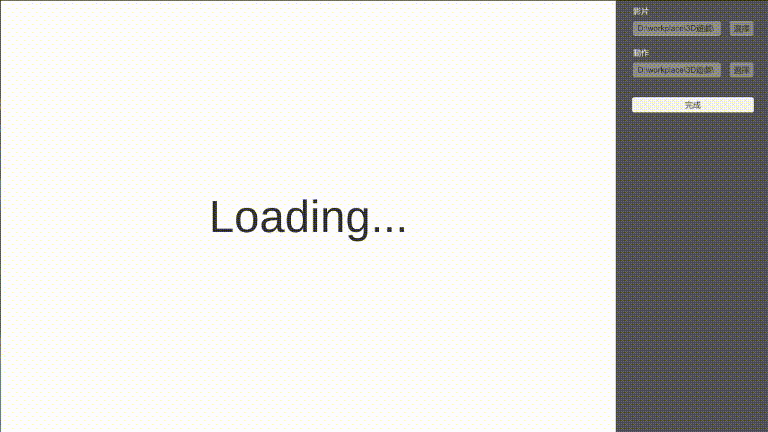

# Dancing Game

> 台灣科技大學 - 3D 電腦遊戲 - Project 5

## 介紹

雖然名為 Dancing Game，但實則是將影片辨識下來的骨架與已知的骨架做比對，並顯示兩者之間局部區域的動作差異，並給予分數。

### 功能

* 

## 使用方式

* 選擇比較的影片與骨架 BVH 檔，並按下完成

> 這邊的 BVH 使用的是 CMU Graphics Lab 所提供的資料集[^1]，或是讀入骨架結構（數目、垂直關係）一樣的 BVH
  

[^1]: [CMU Graphics Lab Motion Capture Database](http://mocap.cs.cmu.edu/)

* 等待載入完成後，會開始播放並取得對應的骨架
  

* 產生出結果
  

* 切換關注的部位
  

## 技術說明

* 

## 運行程式碼

### 安裝或匯入 Library

* [MathNet.Numerics](numerics.mathdotnet.com)
* [UnityStandaloneFileBrowser](https://github.com/gkngkc/UnityStandaloneFileBrowser)
* [ThreeDPoseUnityBarracuda](https://github.com/digital-standard/ThreeDPoseUnityBarracuda)

### 開啟

* 使用 Unity 開啟專案（開發使用版本為 `2020.3.20f1`）

